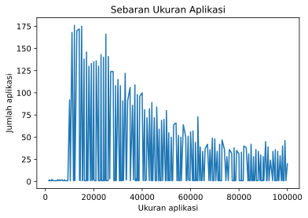

# Play Store Similarity Plot
Data visualization based on 7026 sample apps (and games) on Play Store using Python Matplotlib library.

## Results
1. What are the most popular app categories?
    

      
Answer

      

         
        Family (21.5%), Games (11.9%), Utilities (8.9%), Business & Finance (6.8%), Social & Comms (4.9%)
      

    

3. What is the most common apps (star) rating?
    

      
Answer

      

         
        Most apps are rated 4.4 (722 out of 7026 apps), mean: 4.16
      

    

3. What is the most common apps size?
    

      
Answer

      

         
        Most apps are around 11-26 MB (1597 out of 7026 apps), mean: 41 MB
      

    

4. What is the most common apps (content) rating?
    

      
Answer

      

         
        Most apps are rated for everyone (5676 out of 7026 apps)
      

    

5. What do the top 50 apps have in common?
    

      
Answer

      

        All apps are less or equal to 100 MB (only 1 app is exactly 100 MB), all free, and mostly rated for everyone (36 apps)
      

    

6. What are the top 5 apps?
    

      
Answer

      

        From first to last: Subway Surfers, Google News, SHAREit, UC Browser, Dropbox (based on star rating multiplied by number of downloads)
      

    

## Infographic Poster

   
  Made with Figma

## Source
Dataset was taken from Lavanya ([Kaggle link](https://www.kaggle.com/datasets/lava18/google-play-store-apps)).